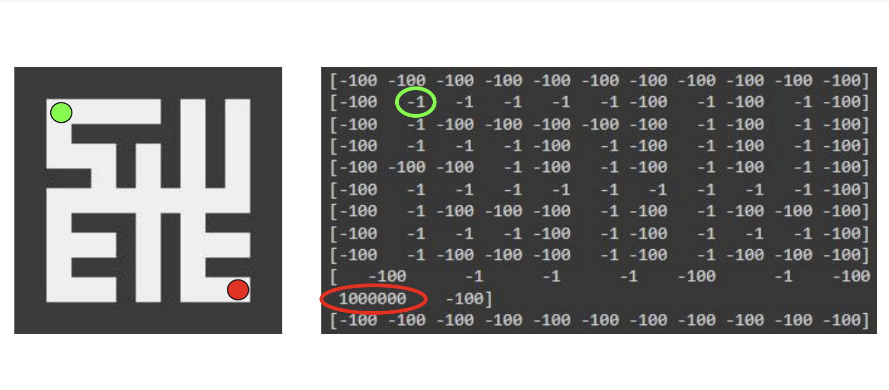
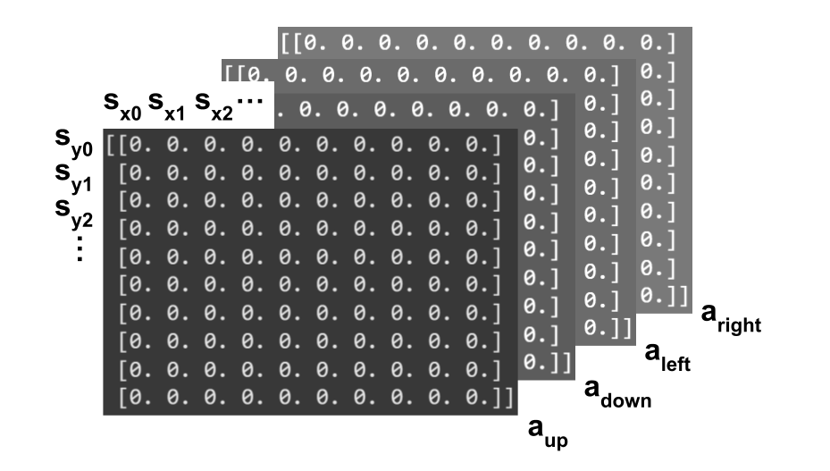
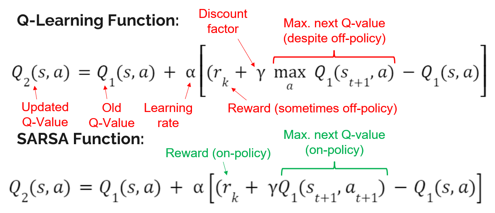
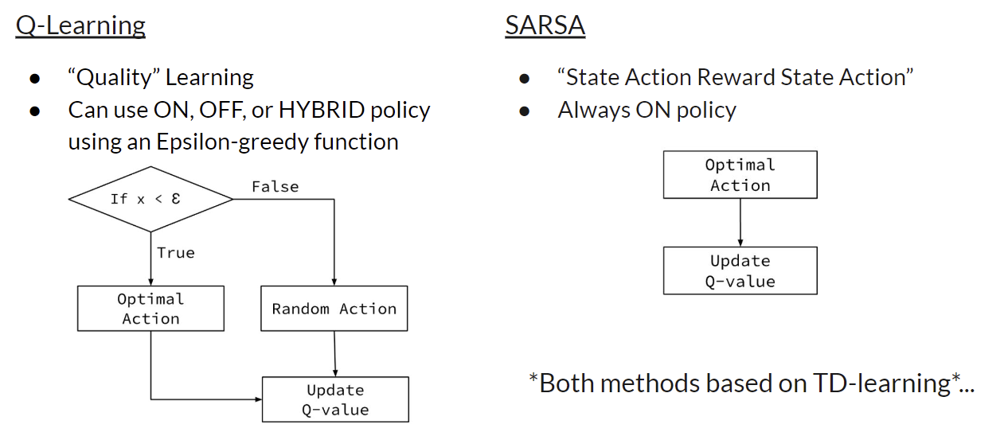
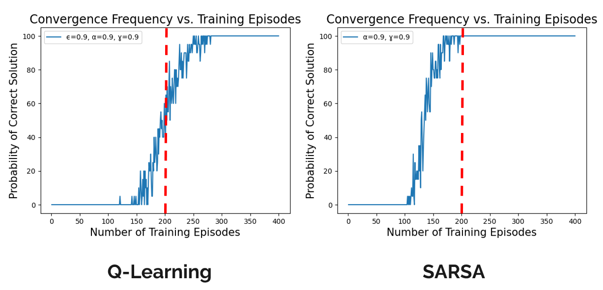

<!-- {}
Click the *Cite* button above to demo the feature to enable visitors to import publication metadata into their reference management software.
{}

{}
Create your slides in Markdown - click the *Slides* button to check out the example.
{}

Add the publication's **full text** or **supplementary notes** here. You can use rich formatting such as including [code, math, and images](https://docs.hugoblox.com/content/writing-markdown-latex/). -->

## Summary
This project applied two model-free reinforcement learning (RL) approaches to maze solving: Q-learning and State-Action-Reward-State-Action (SARSA). The RL models utilized existing OpenCV functions to interpret 9x9 maze images. Each image was automatically generated using a minimum-spanning tree via Kruskal’s algorithm. The model navigated from the top left to the bottom right and was evaluated on factors like proper navigation path output, convergence rate, and run time. Results suggest that certain parameters in both Q-learning and SARSA algorithms can be manipulated for improved performance metrics.

## Maze Analysis and Representation

<figure style="width: 100%; margin: 0;">
    
    <figcaption style="text-align: center;">The maze (left) was modeled using the reward matrix (right). The green dot and circle represent the agent's starting point. The red dot and circle represent the end point.</figcaption>
</figure>

To assign rewards to each cell location, the image was converted to grayscale, and the color
of a single pixel from each cell was sampled using OpenCV. If
the pixel was white, the reward was set to
-1, and if black, the reward was set to -100.
A negative RL system was chosen to
prevent the agent from exploring the maze
indefinitely to maximize rewards. The
bottom right white cell was given a reward
of 100 to ensure that the agent completed
the maze. Each reward was stored in the
matrix seen above to model the maze.

## Markov Decision Process and Q-Tables
RL algorithms are often modeled using the Markov Decision Process (MDP),
a probabilistic model that makes decisions
for an agent in a given environment. An MDP uses a <u>state</u>, <u>action</u>, <u>policy</u>, and <u>reward</u> to interpret and learn about the environment. 

<ul>
  <li>A state, 𝑠, is a summary of an agent’s
current state within its environment defined
by a unique set of variables.</li>
  <li>An action, 𝐴(𝑠), is a deliberate
change in state. </li>
  <li>The policy
is to interpret the agent’s current state and
potential proceeding actions to choose the
state-action pair that maximizes or
minimizes the reward.
</li>
  <li>The reward, <em>R</em>, assigns value to state-action pairs.
  </li>
</ul>

  In this case, the states are position coordinates (x,y) in the maze and the actions are "up", "down", "left", and "right" as seen below.

<figure style="width: 100%; margin: 0;">
    
    <figcaption style="text-align: center;">A visual representation of my empty 3D Q-table before training.</figcaption>
</figure>

 Q-learning and SARSA use Q-tables to evaluate the "quality" of state-action pairs. These tables store Q-values which represent the current estimate of the sum of all future rewards for a certain state-action pair. Both approaches use model-free reinforcement learning, meaning all q-values start at zero and are updated throughout the training phase.

## Training Phase

During training, the agent randomly explores the maze and updates the Q-values as it moves until there are a string of Q-values higher than the rest along the start-->end path. The sequence is as follows:

1) Start at random location/state on the path.
2) Move up, down, right, or left, depending which associated Q-value is highest. If all Q-values are the same, choose one at random.

      a) SARSA: The optimal action (highest Q-value) is always chosen.

      b) Q-Learning: 10% of the time, a random exploratory action is chosen.

3) Update last Q-value.
4) Repeat 2-3 if agent is still on the path. Start over if agent ran into a wall.

Continue until Q-tables converge to an optimal solution!

## Updating Q-Values: Q-Learning vs. SARSA

When the agent encounters a specific state-action (s,a) pair, the algorithm updates the associated Q-value. The updating functions that correspond to Q-learning and SARSA are outlined below.

<figure style="width: 100%; margin: 0;">
    
    <figcaption style="text-align: center;">The functions used to update Q-values in Q-Learning and SARSA algorithms.</figcaption>
</figure>

These two functions have a lot in common:

 Q2(s,a) --> the <u>updated Q-value</u> for a given state-action pair.
 
 Q1(s,a) --> the <u>old Q-value</u> for a given state-action pair.
 
 Alpha (&alpha;) --> the <u>learning rate</u>, which determines how quickly the agent should learn.
 
 Gamma (&gamma;) --> the <u>discount factor</u>, which determines how much future rewards are valued compared to immediate rewards, balancing short-term and long-term decision-making.

The primary difference between the two functions is that the Q-learning function is off-policy while the SARSA function is on-policy. 
This means that Q-learning occasionally selects a lower Q-value to encourage exploration, whereas SARSA consistently chooses the optimal action. 
Q1(st+1, a) and Q1(st+1, at+1) will always equal the maximum Q-value available for the next state, st+1. 
However, in the off-policy Q-learning case, this maximum Q-value may not be the one used to determine the next action. 
As a result, rk always reflects the reward received at the resulting state, regardless of the maximum Q-value. The off-policy nature of Q-learning was informed in this project by an epsilon-greedy algorithm where a random value of x is chosen:

<figure style="width: 100%; margin: 0;">
    
    <figcaption style="text-align: center;">Action-selection logic for Q-Learning and SARSA.</figcaption>
</figure>

## Results

Ultimately, SARSA consistently used less training episodes to converge on the optimal solution. The primary reason was because the Q-learning algorithm attempted to explore the environment further, despite having strong indications throughout training that only one solution to the maze existed. Alternatively, SARSA quickly honed in on the correct solution once it found one.

Below, convergence frequency was plotted against the number of training episodes attempted, clearly showing that SARSA generally converged faster.

<figure style="width: 100%; margin: 0;">
    
    <figcaption style="text-align: center;">Convergence Frequency vs. Training Episodes for Q-Learning and SARSA algorithms.</figcaption>
</figure>

The parameters in the top left of the plot were tweaked as well to produce other plots. These plots can be seen near the end of the slides linked at the top of this page.

