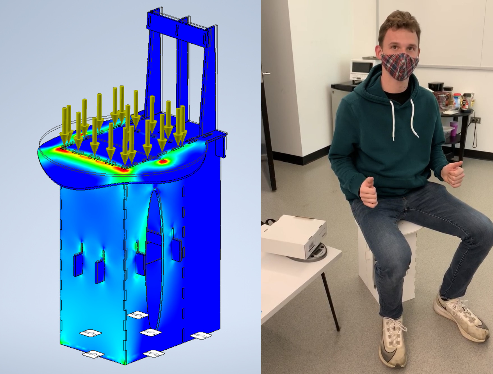
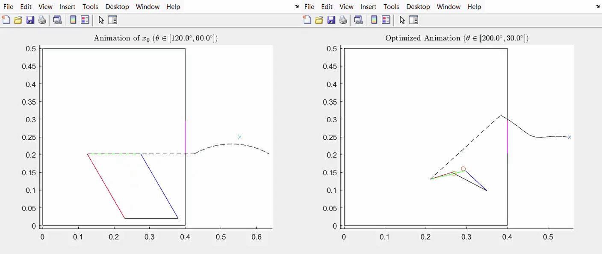
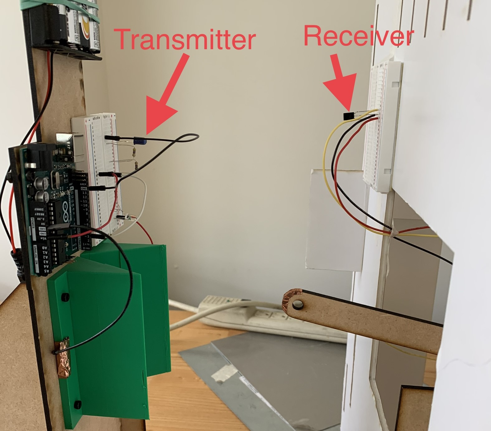

<!-- This work is driven by the results in my [previous paper](/publication/conference-paper/) on LLMs.

{}
Create your slides in Markdown - click the *Slides* button to check out the example.
{}

Add the publication's **full text** or **supplementary notes** here. You can use rich formatting such as including [code, math, and images](https://docs.hugoblox.com/content/writing-markdown-latex/). -->



## Summary

I created this model robot in my teaching assistant position at IIT in effort to redesign the curriculum of a sophomore-level mechanical design course (MMAE 232). The students were required to build a mobile robot that could conceptually "charge an electric vehicle". My robot served as a model for a 3-part, semester-long project  that consisted the following tasks:

1. Design and build a foam-core frame capable of supporting a human's weight.
2. Optimize, design, and build a four-bar linkage.
3. Incorporate the frame and four-bar linkage into a mobile robot capable of navigating an environment, charging an "EV" upon receiving an infrared (IR) signal, and returning to base.

To teach students how to build the robots, I advised and delivered lectures on skills including CAD (Inventor), structural FEA, DFM, Arduino Uno programming, MATLAB, and mechatronics basics. The robots used components including foam-core board, MDF, 3-D printed parts, stepper motors, H-bridges, Arduino Unos, and various fasteners.

## Foam-Core Frame (Part 1/3)

The first part of the project was to construct a sturdy foam core frame that could support the weight of a human. Students designed their frames in Inventor and ran structural FEA to analyze where stress concentrations and failure points might occur. Upon my approval, students laser cut, assembled, and tested the frames.

 My design from Fall 2020 seen in the image below weighed <500g and was able to support both my weight and my professor's. In this version of the course, the design was required to take the form of a chair rather than just a frame. After this test, I continued to sit in my chair each morning for 3 months while I put my socks on until it finally collapsed.

<figure style="width: 100%; margin: 0;">
    
    <figcaption style="text-align: center;">Structural FEA completed on my chair to identify stress concentrations (left) and me sitting on my chair in Fall 2020 (right).</figcaption>
</figure>

## Four-Bar Linkage (Part 2/3)

The second part of this project was to create a four-bar linkage mounted inside of the frame from Part 1. The linkage was required to actuate in and out of a small square in the front of the frame. The linkage needed an end-effector, which was required to make contact with an "EV charging port" four inches away from the frame.

We provided the students with a MATLAB library which ultimately applied fmincon to the linkage's position, size, and constraints. An example is seen below, where the large rectangle represents the frame and pink square slit, the "X" in space represents the "EV charging port", and the moving rectangle on the left represents an initial four-bar linkage that does not meet constraint criteria. The animation on the right represents an optimized solution for the constraint set.

<figure style="width: 100%; margin: 0;">
    
    <figcaption style="text-align: center;">An insufficient four-bar linkage solution (left) and a solution optimized using MATLAB's fmincon that fit the set of constraints provided (right).</figcaption>
</figure>

After finding an optimized solution, students were required to laser cut, build, and integrate their solutions into a frame I provided or their own for extra credit. Below is a video of my optimized four-bar linkage solution actuating in and out of the frame. On the tip of the end effector is a piece of copper tape which makes contact with two other pieces of copper tape, ultimately closing a circuit and turning on a green LED. If the green LED turned on, the "EV" was considered to be successfully "charging".



## EV Charging Robot (Part 3/3)

The final portion of this project required students to put the frame on wheels, navigate to the EV charging port, actuate the four-bar linkage upon receiving a specific IR signal, and retreat to base. The IR signal was emitted from the transmitter mounted to the EV charging port, and the receiver was mounted to the front of the robot as seen below.

<figure style="width: 100%; margin: 0;">
    
    <figcaption style="text-align: center;">The transmitter was mounted on the EV charging port and the receiver was mounted to the front of the robot.</figcaption>
</figure>

The students also received extra credit if their robot successfully charged two EVs in a grid world. The grid worlds I created incorporated obstacles made of MDF and were outlined as follows.

<iframe src="grid_worlds.pdf" width="100%" height="500" frameborder="0"></iframe>

Most students created differential drive robots and elected to charge only one EV. Stepper motors drove the rear wheels which required students to use H-bridge motor drivers and an Arduino Uno. See the video at the top of the page for the final result!