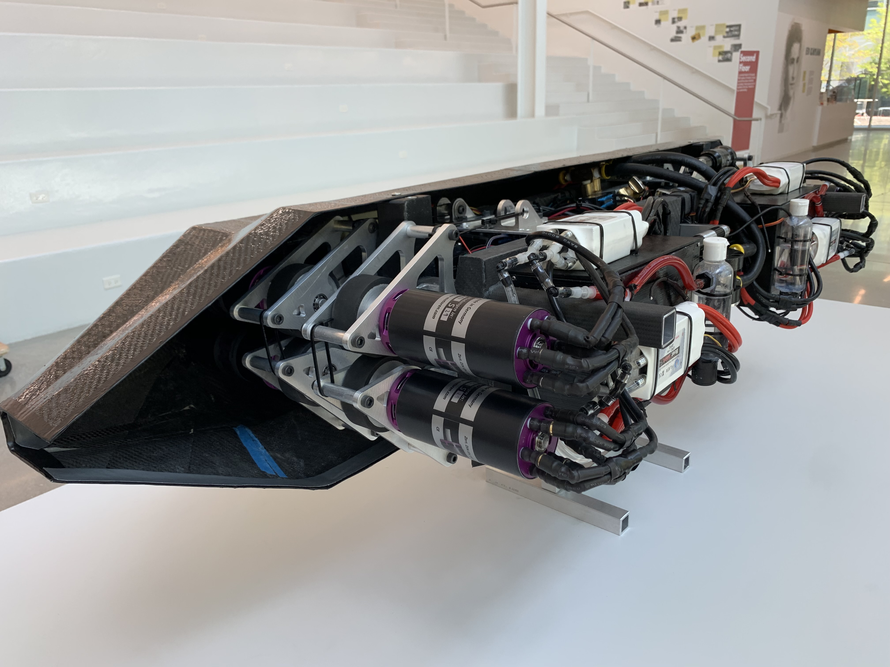
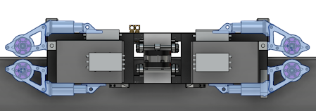
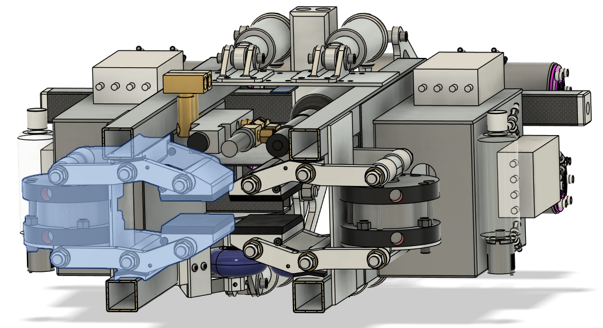
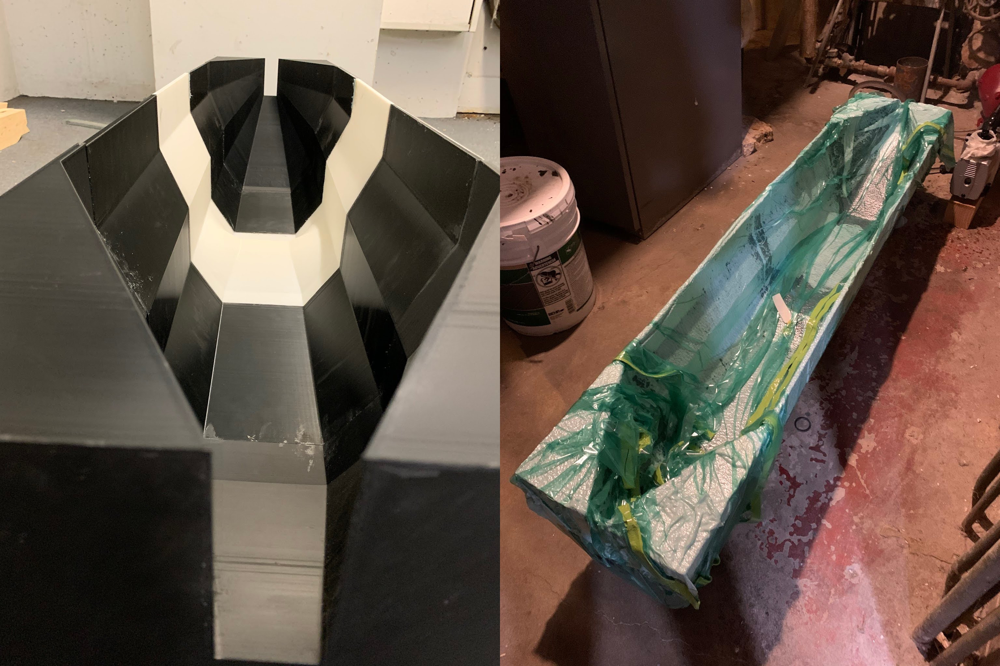
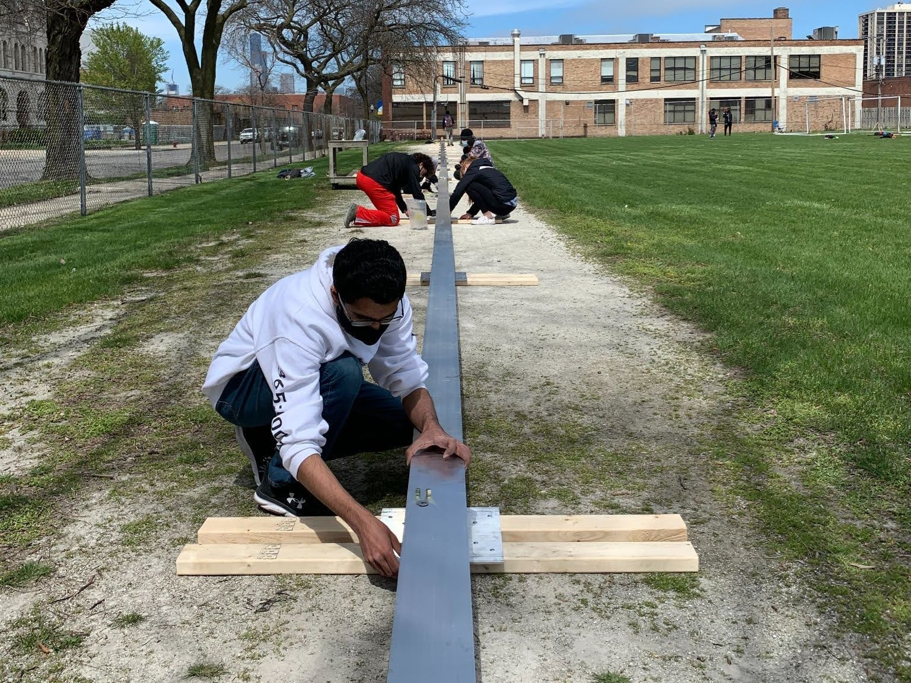

<!-- This work is driven by the results in my [previous paper](/publication/conference-paper/) on LLMs.

{}
Create your slides in Markdown - click the *Slides* button to check out the example.
{}

Add the publication's **full text** or **supplementary notes** here. You can use rich formatting such as including [code, math, and images](https://docs.hugoblox.com/content/writing-markdown-latex/). -->

<figure style="width: 100%; margin: 0;">
    
</figure>

## Summary

The IIT Hyperloop team was a student organization that aimed to compete in the now discontinued <a href="https://en.wikipedia.org/wiki/Hyperloop_pod_competition">SpaceX Hyperloop Pod Competition</a>. As Vice President, I oversaw the design, build, and testing of three hyperloop pods. Over the course of three years, I helped manage a combined budget of ~$70,000 and a team of about 15 people.

## The Hawkmobile 2.0

<figure style="width: 100%; margin: 0;">
    
    <figcaption style="text-align: center;">The final Hawkmobile 2.0 pod prototype.</figcaption>
</figure>

The Hawkmobile 2.0 hyperloop pod was the second iteration of the Hawkmobile (see last section of this page). This design featured a custom carbon fiber shell, a BLDC-based propulsion system, and a pneumatic braking system. One of our members made the following Blender rendering of our pod.



### Propulsion and Suspension

<figure style="width: 100%; margin: 0;">
    
    <figcaption style="text-align: center;">A side-view CAD rendering of the hyperloop pod prototype mounted onto the I-beam track.</figcaption>
</figure>

The image above, the propulsion system is highlighted blue. Wheels were mounted directly to the shafts of BLDC motors. The motors were mounted directly to rocker arms which maintained a point of contact with each of the following: a wheel, a fixed revolving joint on the chassis, and a moving revolving point on a mountain bike shock. Also pictured above are the battery boxes (large grey rectangles), ESCs motor drivers (small grey rectangles on battery boxes), and the braking system (center).

### Braking

<figure style="width: 100%; margin: 0;">
    
    <figcaption style="text-align: center;">A section view of the pod featuring one of the two pneumatic braking systems highlighted in blue on the left. The other is mirrored to right of it.</figcaption>
</figure>

To actuate the braking system, a pneumatic actuator extends vertically to push the  outer joints (far left) of two rocker arms away from one another. The middle joints in the arms function as pivot points. Attached to the inner joints are two aluminum brake pads. Aluminum was chosen because aluminum on aluminum had a very high coefficient of friction, and we were not concerned with damaging the I-beam track that we built. Below is a successful test of alumninum brake pads on an alumninum flywheel.



### Carbon Fiber Frame and Shell

To ensure our design was as lightweight as possible, we opted for a carbon fiber frame and outer shell. Our frame required unique manufacturing and assembly techniques. Most parts were cut using a carbide saw or Dremel blade, but parts with more distinct profiles like the front panels required the use of a CNC mill. Since the part was so thin, the best workholding solution was vacuum workholding. Below is a picture of me holding the parts, the first parts I had ever milled.

<figure style="width: 100%; margin: 0;">
    
    <figcaption style="text-align: center;">Left: The carbon fiber frame with two front panels highlighted. Right: Me holding the front panels after CNC milling them with vacuum workholding</figcaption>
</figure>

The frame was assembled using only epoxy, which required a number of overnight clamping configurations to allow the epoxy to harden. The carbon fiber shell required a wet layup, which none of us had done before. First, we 3D printed five parts that were epoxied together to create a negative mold seen on the left below.

<figure style="width: 100%; margin: 0;">
    
    <figcaption style="text-align: center;">Left: The 3D-printed negative mold. Right: The vacuum bagged carbon fiber wet layup.</figcaption>
</figure>

We then buffed the mold with a mold polish/gel coat and brushed it with a mixture of epoxy cure and laminating resin. We then laid in 4 sheets of carbon fiber, brushing each with the cure/resin mixture. We lined the carbon fiber with cloth and placed it in a 40psi vacuum bag to let it cure overnight as seen in the image above. The next day, we cut the excess hardened carbon fiber with a carbide Dremel fitting, sanded, and sprayed the final product (stickers included!) with a couple of layers of clearcoat as seen below.



### I-Beam Test Track
To test our prototype, we built a 400-foot I-beam test track. Unfortunately, we never did get to use it, as our pod had a lateral suspension system that needed to be completely redesigned and would require work past the end of the school year.
<figure style="width: 100%; margin: 0;">
    
    <figcaption style="text-align: center;">Assembling the 400-foot I-beam test track.</figcaption>
</figure>

### Pod Reveal

At the end of the school year, our President and I presented the work our team had done. At the end of the presentation, we revealed the Hawkmobile 2.0. The slides for the presentation are available at the top of this webpage.



