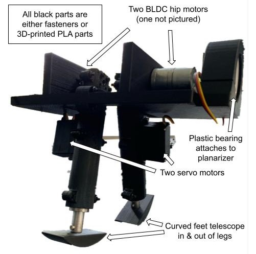

<!-- This work is driven by the results in my [previous paper](/publication/conference-paper/) on LLMs.

{}
Create your slides in Markdown - click the *Slides* button to check out the example.
{}

Add the publication's **full text** or **supplementary notes** here. You can use rich formatting such as including [code, math, and images](https://docs.hugoblox.com/content/writing-markdown-latex/). -->

<figure style="width: 100%; margin: 0;">
    
    <figcaption style="text-align: center;"></figcaption>
</figure>

## Summary

See the <a href="design_review.pdf">PDF</a> and <a href="IROS2023_Poster_Template.pdf">Poster</a> links at the top of the page for more info! 

Testing
control algorithms for bipedal robots on physical hardware can
become a time-consuming and expensive process. The robot
presented in this project offers a modular, open-source platform
for bipedal control algorithm testing for roughly $200. The
manufacturing process requires simple 3D-printing, turning,
and drilling operations. The final prototype can stand passively
and will soon be tested using a planar support mechanism on
a treadmill to constrain the robot to the saggital plane and
identify compatible control approaches.

## Status (In Progress...)

Currently, the robot is being fitted with current sensors to enable elementary feedback control. PID controllers will be the first controllers applied to achieve limit-cycle walking. 
