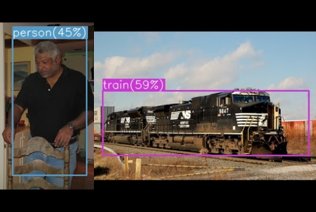

<!-- This work is driven by the results in my [previous paper](/publication/conference-paper/) on LLMs.

{}
Create your slides in Markdown - click the *Slides* button to check out the example.
{}

Add the publication's **full text** or **supplementary notes** here. You can use rich formatting such as including [code, math, and images](https://docs.hugoblox.com/content/writing-markdown-latex/). -->

<figure style="width: 100%; margin: 0;">
    
    <figcaption style="text-align: center;"></figcaption>
</figure>

## Summary

See the <a href="Final Project_ Improving YOLOv2.pdf">PDF above</a> for the full report!

“You Only Look Once version 2” (YOLOv2) is an object detection algorithm capable of
completing real-time object detection tasks. Developed by Joseph Redmon and Ali Farhadi, YOLOv2 is a deep learning-based algorithm that approaches object
detection as a single regression problem. After dividing an input image into a grid, the algorithm
uses anchor bounding boxes around objects and produces class probabilities for each grid cell.
The algorithm then uses this data and performs feature extraction based on prior training over a
set of image classes using a deep convolutional neural network (CNN).

In this project, I attempted to modify the the Darknet-19 backbone used by YOLOv2. All Max Pooling layers in the backbone were replaced by convolutional layers in an attempt to increase the amount of relevant information being transmitted between layer input and output. My attempt did not outperform the baseline model at the 50 epoch checkpoint, as the mean average precision (mAP) decreased from 70% to 28% and the frames per second (FPS) rate decreased from 71.88 to 62.63. Eventually, I would like to go back and attempt to replace the Darknet-19 backbone with a residual backbone like ResNet or modify the loss function to improve performance.

